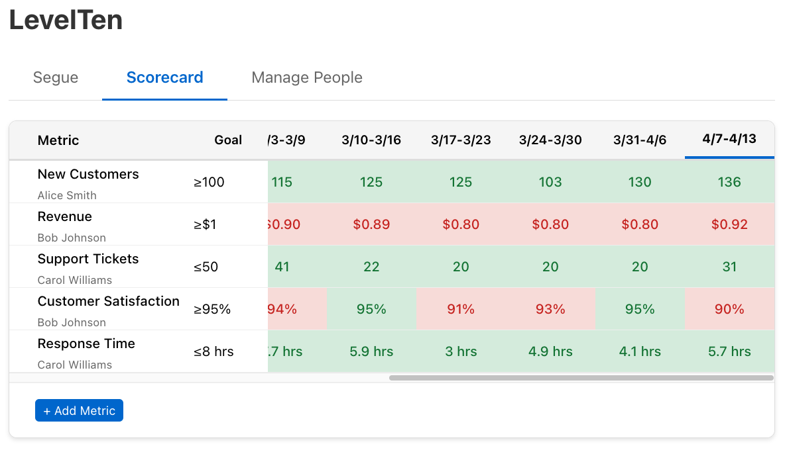

# LevelTen

A web application for tracking important company metrics by week against configurable targets with a SQLite backend and real-time updates.



## Features

- Track metrics in a weekly grid format with real date ranges (Monday-Sunday)
- Set target values with various comparison operators (greater than, less than, equal to, etc.)
- Express values using exponents (1k, 1m) for easier data entry and display
- Associate metrics with responsible owners
- Colorized display to quickly identify metrics that are on/off target
- Horizontal scrolling for historical data with fixed metric and target columns
- Clean, minimalist interface with compact week columns
- Click-to-edit for metrics, goals, and data values
- Simplified controls with context-appropriate delete links
- Secure deletion with confirmation requiring exact name input
- Automatic scroll positioning to show the most recent weeks
- Only fully completed weeks are shown (Monday-Sunday)
- Automatic addition of new week columns when a week is completed
- Robust database backend with SQLite
- Real-time updates across multiple connected clients
- Segue randomizer to select random people during team meetings

## Tech Stack

### Frontend
- React
- TypeScript
- Styled Components
- React Router
- Socket.io Client

### Backend
- Node.js
- Express
- SQLite3
- Socket.io

## Getting Started

### Prerequisites

- Node.js (v14 or later)
- npm or yarn

### Installation

1. Clone the repository
2. Install all dependencies (frontend and backend):

```bash
npm run install:all
```

### Environment Configuration

The server supports configuration through environment variables. Create a `.env` file in the server directory or set these variables in your environment:

```
# Server configuration
PORT=3001

# Database configuration
# Empty DB_PATH uses the default './data' directory
DB_PATH=
DB_NAME=scorecard.db
```

A sample `.env.example` file is provided in the server directory.

#### Frontend Environment Variables

The frontend supports the following environment variables:

```
# API URL configuration
REACT_APP_API_URL=http://localhost:3001

# Application name
REACT_APP_APP_NAME=LevelTen
```

### Running the app

#### Local Development

To run both the frontend and backend concurrently:

```bash
npm run dev
```

This will start:
- The frontend development server at http://localhost:3000
- The backend API server at http://localhost:3001

To run only the frontend:

```bash
npm start
```

To run only the backend:

```bash
npm run server:dev
```

#### Docker Deployment

**Production Mode**

To build and run the production version in a Docker container:

```bash
docker-compose up -d
```

To specify a custom API URL or application name:

```bash
API_URL=http://your-api-url APP_NAME=YourAppName docker-compose up -d
```

This will:
- Build the React frontend
- Create a production-ready Docker image
- Run the application on port 3000
- Persist data in a Docker volume

**Development Mode**

For development with hot reloading:

```bash
docker-compose -f docker-compose.dev.yml up
```

This starts:
- Frontend container with React development server on port 3000
- Backend container with nodemon for auto-reloading on port 3001
- Data persistence through a Docker volume

## Architecture

The application is structured as follows:

1. **Frontend (React/TypeScript)**
   - Uses React Router for navigation between tabs
   - Communicates with the backend via REST API
   - Receives real-time updates via Socket.io

2. **Backend (Node.js/Express)**
   - RESTful API endpoints for CRUD operations
   - SQLite database for data persistence
   - Socket.io for broadcasting data changes to all connected clients

3. **Database (SQLite)**
   - Stores people, metrics, weeks, and weekly values
   - Maintains relationships between entities
   - Automatically initializes with sample data if empty
   - Configurable database location through environment variables
   - Default location: `./data/scorecard.db` (relative to project root)
   - Automatically creates the data directory if it doesn't exist
   - When using Docker, data is persisted in a named volume

## API Endpoints

- **People**
  - GET `/api/people` - Get all people
  - GET `/api/people/:id` - Get a single person
  - POST `/api/people` - Create a new person
  - PUT `/api/people/:id` - Update a person
  - DELETE `/api/people/:id` - Delete a person

- **Metrics**
  - GET `/api/metrics` - Get all metrics
  - POST `/api/metrics` - Create a new metric
  - PUT `/api/metrics/:id` - Update a metric
  - DELETE `/api/metrics/:id` - Delete a metric

- **Weeks**
  - GET `/api/weeks` - Get all completed weeks
  - POST `/api/weeks/update` - Check for and add new completed weeks

- **Weekly Values**
  - GET `/api/weekly-values` - Get all weekly values
  - POST `/api/weekly-values` - Create or update a weekly value

## Real-Time Updates

The application uses Socket.io to broadcast changes to all connected clients. When a user makes a change, the following events can be emitted:

- `person_created`, `person_updated`, `person_deleted`
- `metric_created`, `metric_updated`, `metric_deleted`
- `weekly_value_created`, `weekly_value_updated`
- `weeks_updated`

Connected clients receive these events and automatically update their data, providing a seamless collaborative experience.

## Usage

1. Add people who are responsible for metrics
2. Create metrics with target values and operators
3. Add weekly data for each metric
4. View the scorecard to see performance against targets
5. Use the Segue tab to randomly select team members during meetings